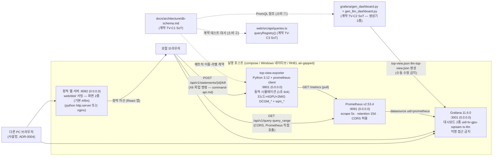
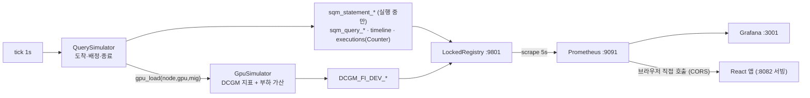

# 시스템 아키텍처 — LLM/GPU Top-View 통합 프로젝트

`../서류/gpu_dashboard.pptx`의 top view 화면을 재현하는 통합 스택이다. 단일 exporter가 모든 메트릭을 **동적 시뮬레이션**(쿼리 라이프사이클 + GPU 부하 결합)으로 노출하고(ADR-0001·ADR-0008), **두 개의 UI가 병행**한다 — Grafana 단일 대시보드(TV-C2)와 React 단일 페이지 앱(Grafana 임베드·백엔드 프록시 없음, ADR R-0001). 실제 SQream/GPU에는 접속하지 않는다.

> 본 문서는 통합(Phase U3, 2026-07-19) 시 구 `top_view_mockup/docs/architecture/system.md`와
> `top_view_react/docs/architecture/system.md`를 병합해 재작성했다. 원본은 git 이력(U3 커밋의
> rename/삭제 이전 리비전)에 보존되어 있다.

## 컴포넌트 다이어그램



## 데이터 흐름

1. exporter의 **조정자(Simulation)** 가 1초마다 tick한다.
   - `QuerySimulator`: 노드별 포아송 도착 → 빈 MIG 슬롯 배정(없으면 큐 대기) → 실행(30~180초) → 종료. 종료 시 statement 라벨셋을 `remove()`하고 실행 수 Counter를 올린다.
   - `LlmSimulator`(v3.0): GPU 단위 12슬롯 — 장수 서비스 4종(서버-01 GPU 0~3 상주 ↔ 재시작 창)과 단명 배치(trainer 등, 포아송)가 `llm_*` 메트릭 10종을 생산한다.
   - `GpuSimulator`: DCGM 지표 = 기저 사인파 + 랜덤워크 + 스파이크 **+ 부하 오프셋 `max(쿼리 부하, LLM 부하)`**(인간 확정 2026-07-19 — 지배 워크로드가 지표를 결정).
   - tick과 scrape(collect)는 같은 락으로 직렬화된다(반쪽 상태 노출 방지).
2. Prometheus가 5초 주기로 pull 수집한다(타깃 1개).
3. **UI ① Grafana**: 프로비저닝된 대시보드 2종(`tv-gpu-sqream`·`tv-llm`)에서 PromQL로 조회한다. 기본 시간범위 **Last 30 minutes**(시간 압축 — 쿼리 지속 30초~3분).
4. **UI ② React**: 브라우저가 정적 서버(:8082)에서 앱을 로드하고, `web/src/api/queries.ts`의 PromQL로 Prometheus(:9091)를 **직접** 호출한다 — instant(테이블·게이지·구간 상세) + range(시계열·타임라인). 화면 2종은 해시로 전환한다(기본=GPU/SQream, `#/llm`=GPU/LLM — ADR 0010, 화면별 훅이라 비마운트 화면은 폴링하지 않음). `usePolling` 훅이 5초 주기 갱신(겹침 방지·타임아웃·연속 실패 고지), C3(시계열·게이지)·D3(타임라인)가 렌더한다. Prometheus base URL 기본값은 **앱이 서빙되는 호스트의 :9091**(하드코딩 없음, 필요 시 빌드에 `VITE_PROM_URL` — ADR R-0004).
5. **명령 경로 (X6, 유일한 역방향)**: 드릴다운 Query 팝업의 Kill이 exporter(:9801)에 `POST /api/v1/statements/{id}/kill`을 보낸다 — HTTP 스레드는 **예약만** 하고(세대 토큰 `start_time` 대조 포함), 반영은 다음 tick의 종료 기계가 `killed_by_admin`으로 처리한다. 상세·제약은 `command-api.md`, 결정은 ADR-0011.



## web/ 계층 규칙 (AGENTS.md §5)

```
components/  ← UI만. PromQL·fetch 금지
   ↑
hooks/       ← 폴링·필터 상태·파생 데이터
   ↑
api/         ← prom.ts(저수준 fetch) · queries.ts(PromQL 유일 정의처 — TV-C3)
```

## 실행 모드

| 모드 | 구성 | 비고 |
| --- | --- | --- |
| docker-compose (기본) | exporter(build)·prometheus·grafana·web(nginx가 `web/dist/` 서빙) | 컨테이너 내부 datasource URL `http://prometheus:9090` |
| Windows 네이티브 | venv python exporter / portable Prometheus / portable Grafana / python `http.server`(:8082) — `native/*.ps1` | datasource URL `http://localhost:9091`, 대시보드 JSON은 repo 생성물 참조(TV-C2 단일 소스) |
| RHEL 8.x air-gapped | `native-linux/*.sh` + systemd 유닛 4종. React는 개발 PC에서 `npm run build`한 `web/dist/`만 반입해 서빙 | 현장에는 Docker·Node 없음 — 런타임 Node 요구 구성 금지(ADR R-0004) |
| (web 개발) | Vite dev 서버 `:5173` (HMR) | 개발 PC 전용 |

## 포트·바인딩 요약

| 컴포넌트 | 포트 | 바인딩 | 기존 `../mockup`과의 충돌 |
| --- | --- | --- | --- |
| exporter | 9801 | 0.0.0.0 | 없음 (mockup: 9100/9110/9256/9400/9500) — `/metrics` 외에 목업 명령 API(X6 kill, `command-api.md`)도 이 포트다 |
| Prometheus | 9091 | 0.0.0.0 | 없음 (mockup: 9090) |
| Grafana | 3001 | 0.0.0.0 | 없음 (mockup: 3000, custom-ui 8080) |
| React 정적 서버 | 8082 | 0.0.0.0 | 없음 |
| Vite dev 서버 | 5173 | 127.0.0.1 | 없음 (개발 전용) |

## 계약 요약 (전체 표는 plan.md §3)

- **TV-C1** — 메트릭 이름·라벨 스키마(**v3.0** — v2.0 MIG + `llm_*` 10종 additive §6). SoT `docs/architecture/db-schema.md`, 생산 `exporter/exporter/metrics.py`, **소비 2곳**(Grafana 생성기 2종 + web queries.ts). 변경 시 한 커밋 3자 검증.
- **TV-C2** — Grafana 대시보드 JSON **집합**. SoT 생성기 2종(`grafana/gen_dashboard.py`·`gen_llm_dashboard.py`), 생성물 수동 수정 금지, 드리프트 0 게이트(json 디렉터리 단위).
- **TV-C3** — React 소비 PromQL 레지스트리. SoT `web/src/api/queries.ts`의 `queryRegistry()`. 계약 테스트가 `npm run build` 경로에 있어 **계약 위반 시 `dist/`가 생성되지 않는다.**
